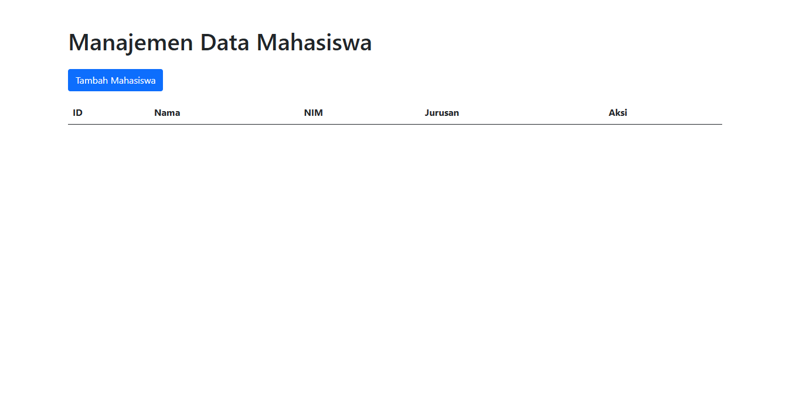
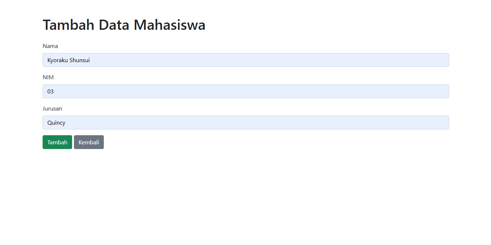
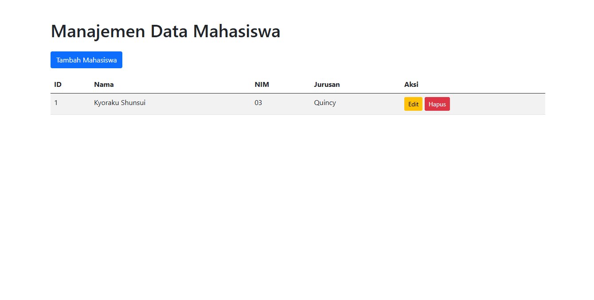
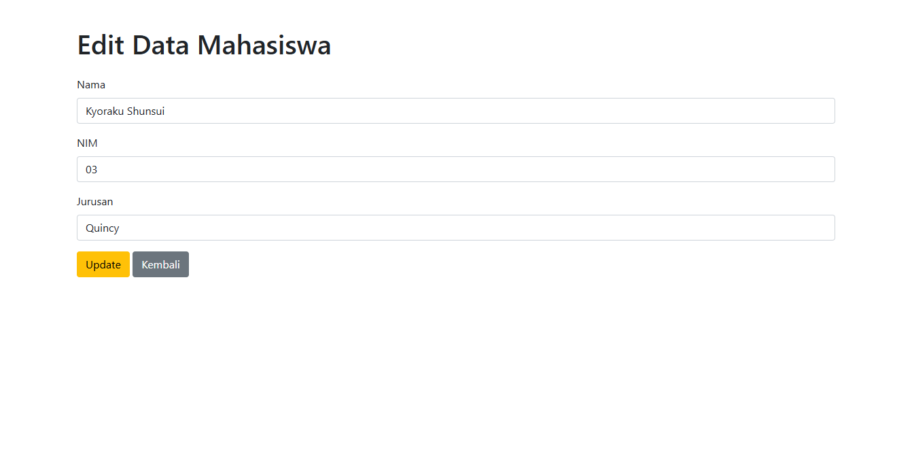
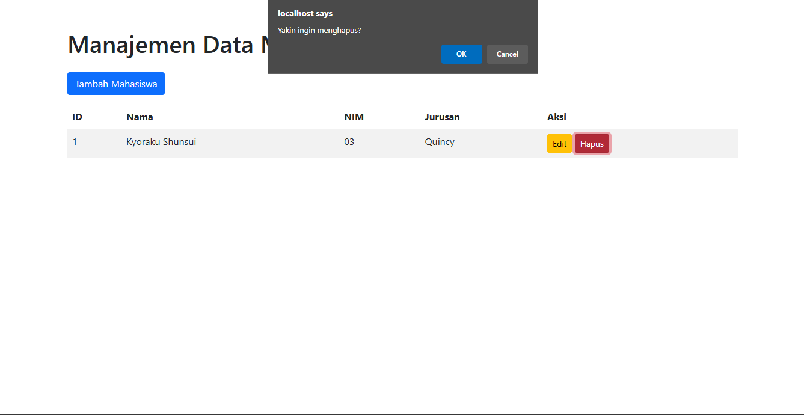

# CRUD

## Profil

| Variable        | Isi             |
| --------------- | --------------- |
| **Nama**        | Dendi Permana   |
| **NIM**         | 312310694       |
| **Kelas**       | TI.23.A.6       |
| **Mata Kuliah** | Pemrograman Web |

### Code

Index.php

    <?php include 'db.php'; ?>

    <!DOCTYPE html>
    <html lang="en">
    <head>
        <meta charset="UTF-8">
        <meta name="viewport" content="width=device-width, initial-scale=1.0">
        <title>Data Mahasiswa</title>
        <link rel="stylesheet" href="assets/css/bootstrap.min.css">
        <link rel="stylesheet" href="assets/css/datatables.min.css">
    </head>
    <body>
    

        <h1 class="mb-4">Manajemen Data Mahasiswa</h1>
        <a href="add.php" class="btn btn-primary mb-3">Tambah Mahasiswa</a>
        <table id="mahasiswaTable" class="table table-striped">
            <thead>
                <tr>
                    <th>ID</th>
                    <th>Nama</th>
                    <th>NIM</th>
                    <th>Jurusan</th>
                    <th>Aksi</th>
                </tr>
            </thead>
            <tbody>
                <?php
                $stmt = $conn->query("SELECT * FROM mahasiswa");
                while ($row = $stmt->fetch(PDO::FETCH_ASSOC)) {
                    echo "<tr>
                        <td>{$row['Id']}</td>
                        <td>{$row['Nama']}</td>
                        <td>{$row['NIM']}</td>
                        <td>{$row['Jurusan']}</td>
                        <td>
                            <a href='edit.php?Id={$row['Id']}' class='btn btn-warning btn-sm'>Edit</a>
                            <a href='delete.php?Id={$row['Id']}' class='btn btn-danger btn-sm' onclick='return confirm(\"Yakin ingin menghapus?\");'>Hapus</a>
                        </td>
                    </tr>";
                }
                ?>
            </tbody>
        </table>
    

    
    
    
    
    </body>
    </html>

Add.php

    <?php include 'db.php'; ?>

    <?php
    if ($_SERVER['REQUEST_METHOD'] == 'POST') {
        $Nama = $_POST['Nama'];
        $NIM = $_POST['NIM'];
        $Jurusan = $_POST['Jurusan'];

        $stmt = $conn->prepare("INSERT INTO mahasiswa (Nama, NIM, Jurusan) VALUES (?, ?, ?)");
        $stmt->execute([$Nama, $NIM, $Jurusan]);
        header('Location: index.php');
    }
    ?>

    <!DOCTYPE html>
    <html lang="en">
    <head>
        <meta charset="UTF-8">
        <meta name="viewport" content="width=device-width, initial-scale=1.0">
        <title>Tambah Mahasiswa</title>
        <link rel="stylesheet" href="assets/css/bootstrap.min.css">
    </head>
    <body>
    

        <h1 class="mb-4">Tambah Data Mahasiswa</h1>
        <form method="POST">
            

                <label for="Nama" class="form-label">Nama</label>
                <input type="text" class="form-control" id="Nama" name="Nama" required>
            

            

                <label for="NIM" class="form-label">NIM</label>
                <input type="text" class="form-control" id="NIM" name="NIM" required>
            

            

                <label for="Jurusan" class="form-label">Jurusan</label>
                <input type="text" class="form-control" id="Jurusan" name="Jurusan" required>
            

            <button type="submit" class="btn btn-success">Tambah</button>
            <a href="index.php" class="btn btn-secondary">Kembali</a>
        </form>
    

    </body>
    </html>

db.php

    <?php
    $host = 'localhost';
    $user = 'root';
    $password = '';
    $dbname = 'crud_app';

    try {
        $conn = new PDO("mysql:host=$host;dbname=$dbname", $user, $password);
        $conn->setAttribute(PDO::ATTR_ERRMODE, PDO::ERRMODE_EXCEPTION);
    } catch (PDOException $e) {
        echo "Koneksi gagal: " . $e->getMessage();
    }
    ?>

delete.php

    <?php
    include 'db.php';

    $id = $_GET['Id'];
    $stmt = $conn->prepare("DELETE FROM mahasiswa WHERE Id = ?");
    $stmt->execute([$id]);

    header('Location: index.php');
    ?>

edit.php

    <?php include 'db.php'; ?>

    <?php
    $id = $_GET['Id'];
    $stmt = $conn->prepare("SELECT * FROM mahasiswa WHERE Id = ?");
    $stmt->execute([$id]);
    $data = $stmt->fetch();

    if ($_SERVER['REQUEST_METHOD'] == 'POST') {
        $nama = $_POST['Nama'];
        $nim = $_POST['NIM'];
        $jurusan = $_POST['Jurusan'];

        $stmt = $conn->prepare("UPDATE mahasiswa SET Nama = ?, NIM = ?, Jurusan = ? WHERE Id = ?");
        $stmt->execute([$nama, $nim, $jurusan, $id]);
        header('Location: index.php');
    }
    ?>

    <!DOCTYPE html>
    <html lang="en">
    <head>
        <meta charset="UTF-8">
        <meta name="viewport" content="width=device-width, initial-scale=1.0">
        <title>Edit Mahasiswa</title>
        <link rel="stylesheet" href="assets/css/bootstrap.min.css">
    </head>
    <body>
    

        <h1 class="mb-4">Edit Data Mahasiswa</h1>
        <form method="POST">
            

                <label for="Nama" class="form-label">Nama</label>
                <input type="text" class="form-control" id="Nama" name="Nama" value="<?= $data['Nama'] ?>" required>
            

            

                <label for="NIM" class="form-label">NIM</label>
                <input type="text" class="form-control" id="NIM" name="NIM" value="<?= $data['NIM'] ?>" required>
            

            

                <label for="Jurusan" class="form-label">Jurusan</label>
                <input type="text" class="form-control" id="Jurusan" name="Jurusan" value="<?= $data['Jurusan'] ?>" required>
            

            <button type="submit" class="btn btn-warning">Update</button>
            <a href="index.php" class="btn btn-secondary">Kembali</a>
        </form>
    

    </body>
    </html>

#### Screenshot

Sebelum tambah data

Tambah data

Setelah ditambah data

Edit

Hapus

